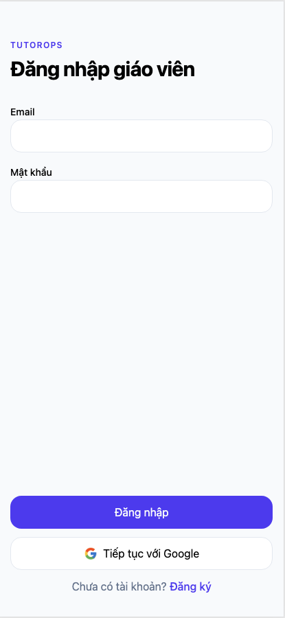
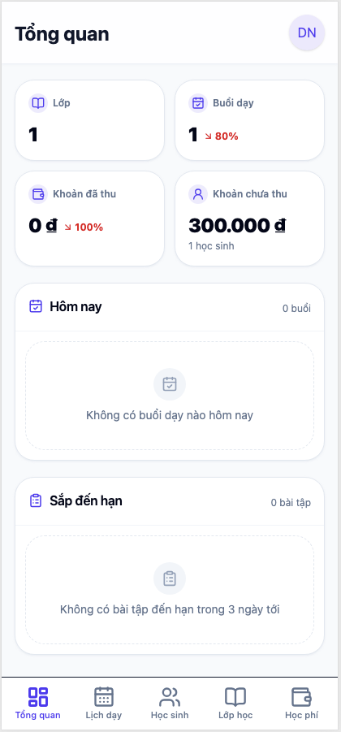
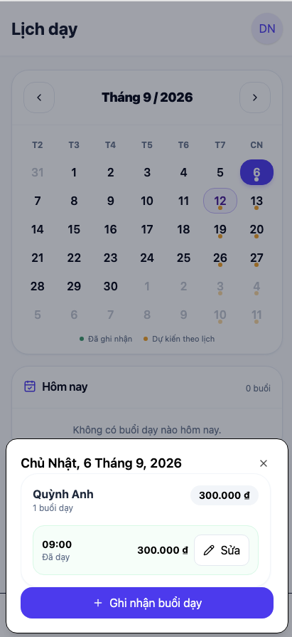
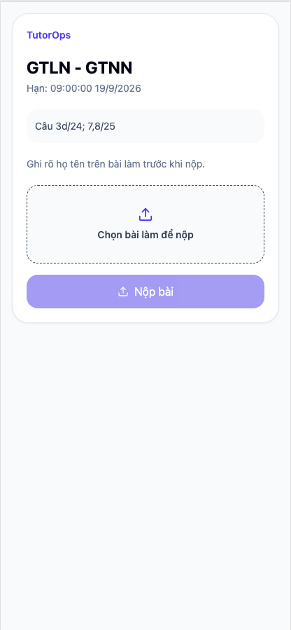
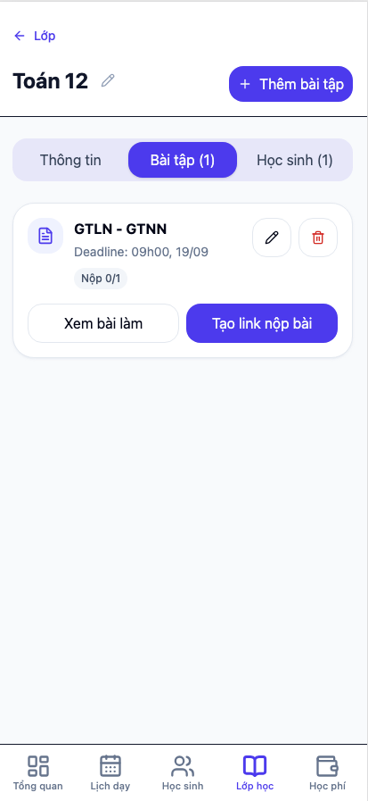
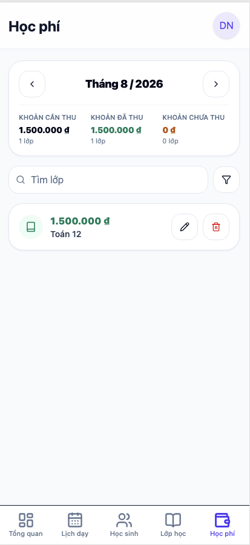
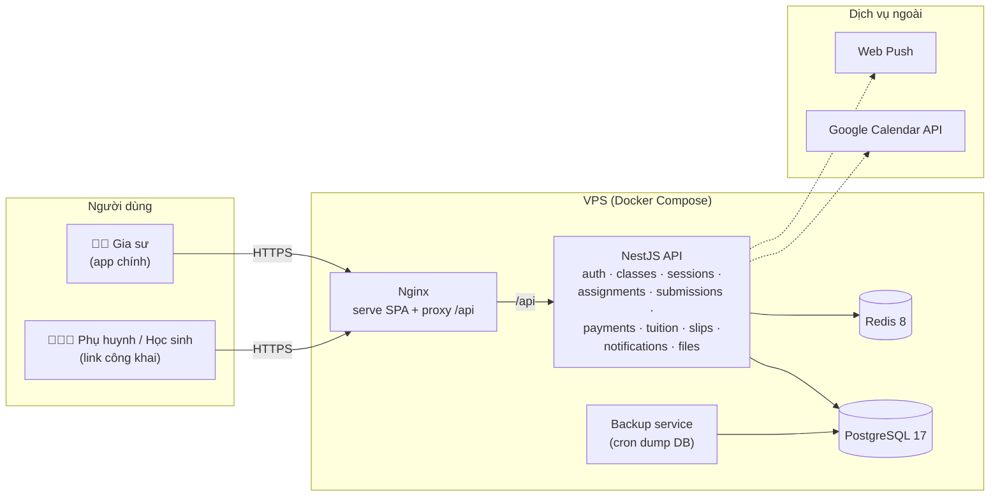

# TutorOps

> Hệ thống quản lý công việc cho gia sư — lịch dạy, điểm danh, học phí, bài tập và thông báo, kèm link công khai cho phụ huynh/học sinh.

## Link

- **App:** https://tutorops.io.vn/ (deploy trên VPS)
- **Phụ huynh / học sinh:** không cần tài khoản — nhận phiếu học phí và nộp bài qua link công khai.

## 📱 Screenshots

| Đăng nhập | Tổng quan | Lịch dạy |
| --------- | -------- | ------- |
|  |  |  |

| Link nộp bài | Lớp học | Học phí |
| --------- | -------- | ------- |
|  |  |  |

## ✨ Features

**Cho gia sư (app chính)**

- Quản lý lớp học, học sinh, lịch dạy theo tuần (calendar-first)
- Điểm danh buổi học — học phí tự động tính theo buổi đã dạy
- Bài tập + dropbox nộp bài, review bài của học sinh
- Phiếu học phí tháng (monthly slip) gửi phụ huynh qua link
- Thông báo push, đồng bộ Google Calendar

**Cho phụ huynh / học sinh (không cần tài khoản)**

- Nộp bài qua link công khai
- Xem phiếu học phí tháng

## 🛠 Tech Stack

| Layer    | Tech                                              |
| -------- | ------------------------------------------------- |
| Frontend | React + Vite, shadcn/ui, mobile-first             |
| Backend  | NestJS, PostgreSQL (raw SQL + Drizzle migrations) |
| Infra    | Docker Compose, Redis, Nginx                      |

## 🏗 Architecture



Xem chi tiết nghiệp vụ trong [`docs/`](docs/): [BUSINESS_RULES.md](docs/BUSINESS_RULES.md), [DATA_SCHEMA.md](docs/DATA_SCHEMA.md), [FR_NFR.md](docs/FR_NFR.md), [UI-UX-design.md](docs/UI-UX-design.md).

## 📂 Project Structure

```
backend/    NestJS API (module pattern: controller/service/repository/dto)
frontend/   React + Vite SPA
docs/       Tài liệu nghiệp vụ, schema, thiết kế UI
scripts/    Backup / migrate helpers
backup/     Backup service (cron dump DB)
```

## 🔮 Roadmap / Limitations

- [ ] Admin dashboard
- [ ] CI/CD pipeline
- [ ] Google Calendar sync (2-way)
